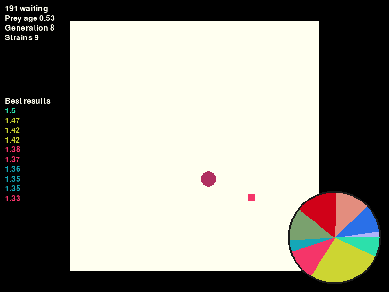

# pylife

This is a small pygame project I made to learn about neural networks.
It's a simulation of an actor learning to escape a single predator through successive generations.



## How to run

```
python3 -m chase
```
or  
```
make
```

## How to use

`Spacebar` - speed up simulation  
`K` - kill the current actor
(in case it's doing too well and not getting caught)  
`D` - dump NN weights of the current actor to a file, `brain.json`

You can pass the dumped NN wegiht file as a parameter to start the
simulation where you left off.

```
python3 -m chase brain.json
```
